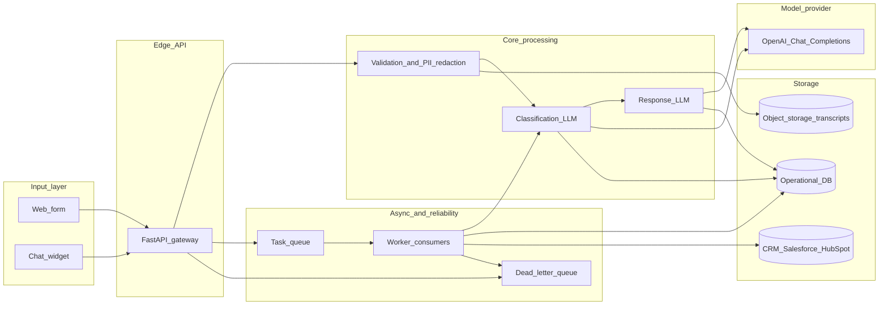

# VARYNT — AI Lead Qualification + Smart Response (architecture)

End-to-end view of a production-shaped system. Q2 implements the **API + synchronous pipeline** slice; other components are specified here for scale and operability.

## Component diagram

## 1. Input layer (form / chat)

- **Web form** posts structured fields + free text; **chat widget** streams or batches utterances into the same canonical **Lead** record (`source`, `message`, optional `email`, `company`, `name`).
- **Ingress:** HTTPS only, rate limiting, bot protection (e.g. CAPTCHA on form), request size caps.
- **Normalization:** trim whitespace, unify encoding, attach `received_at`, `channel`, `campaign` metadata.

## 2. LLM / model usage

- **Two call sites:** (A) **classification** → Hot / Warm / Cold JSON; (B) **first response** JSON (`message`, optional `subject_line`).
- **Provider:** OpenAI **Chat Completions** with a **pinned model** in code (`gpt-4o-mini` in Q2) so token/limit parameters stay valid.
- **Modes:** **live** (`OPENAI_API_KEY`) vs **mock** (no key or forced), for CI and cost-free demos.
- **Contracts:** `response_format: json_object` where supported; Pydantic validation on parsed output.

## 3. Classification logic

- **Primary:** LLM classifier with strict JSON schema and conservative rules (prefer Warm over Hot when uncertain).
- **Secondary (future):** rules for obvious spam/PII patterns; optional lightweight keyword priors **only** as features fed to the model or as post-checks — not as the sole logic in MVP.

## 4. Response generation

- **Input:** lead payload + classification JSON + (future) product snippets from a **grounded** knowledge allowlist.
- **Output:** short, contextual reply with a single next step; subject line optional for email channel.
- **Safety:** prompt guardrails + validation; no invented pricing/features (see Q3).

## 5. Storage (DB / CRM)

- **Operational DB:** leads table (raw message, redacted copy, classification, model version, latency, `llm_mode`), audit log, idempotency keys per submission.
- **CRM sync:** async worker pushes qualified leads and conversation state to Salesforce/HubSpot; failures retried with backoff.
- **Object storage (optional):** raw transcripts if retention/compliance requires separation from relational DB.

## 6. Queue / async handling

- **Sync path (MVP / Q2):** small customers or low volume — classify + respond inline with timeouts.
- **Async path (scale):** API enqueues **QualifyLeadJob**; workers perform LLM calls, persist results, trigger CRM sync and notifications; **DLQ** for poison messages after max retries.
- **Back-pressure:** queue depth alerts; shed load by returning “received, we’ll email you” for chat when overloaded.

## 7. Fallbacks

- **LLM timeout / 5xx / rate limit:** retry with jitter (limited attempts); then **degraded response** — templated reply by bucket + log incident; optional human queue for Hot leads.
- **Invalid JSON / schema drift:** retry once with repair prompt; else fallback template + alert.
- **Garbage / ambiguous input:** see Q4 — short safe reply, Cold/Warm bucket, no aggressive sales CTA.
- **Mock mode:** deterministic classifier for dev/test without API spend.

## 8. Cross-cutting

- **Observability:** structured logs, metrics, traces (Q5).
- **Security:** secrets in vault/KMS; PII minimization; retention policy.
- **Model changes:** gated releases — update pinned model id **and** validate API parameters in the same change (documented in the Q2 README and code).
